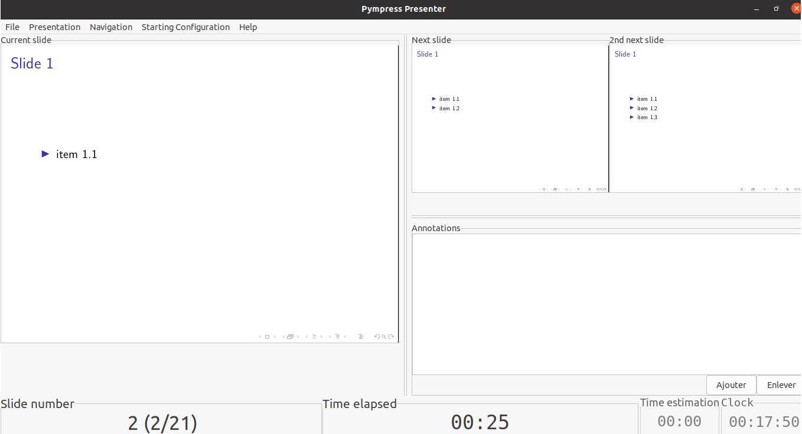
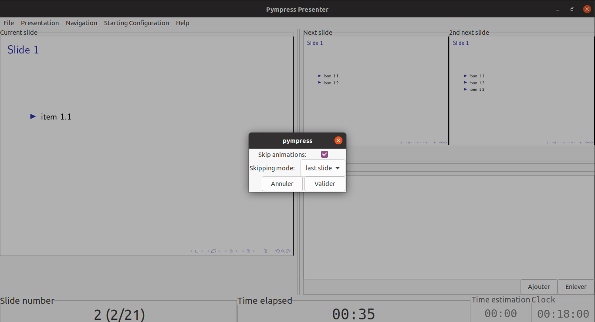
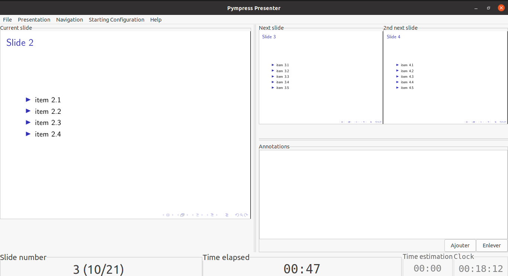
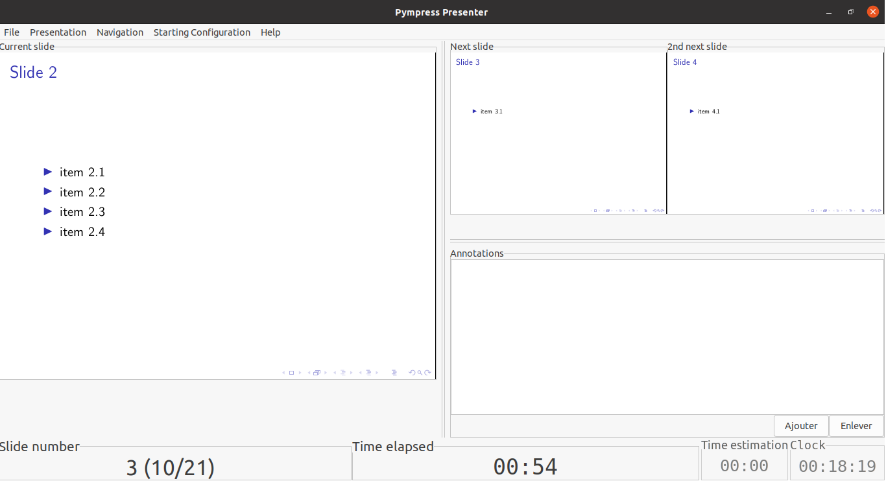

This is a fork of [Pympress](https://github.com/Cimbali/pympress) with an additional option allowing to skip animations (such as [beamer](https://ctan.org/pkg/beamer) anim) when displaying the next slides.

